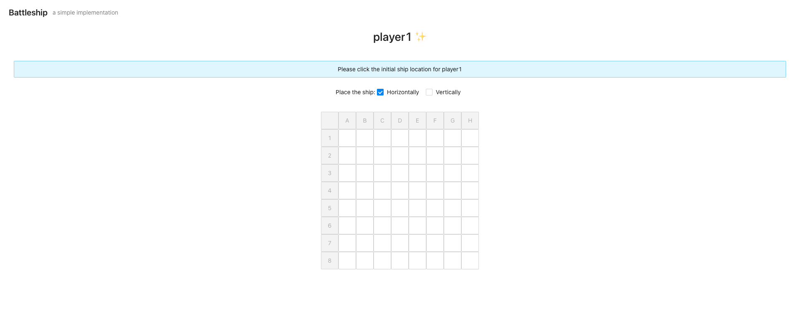
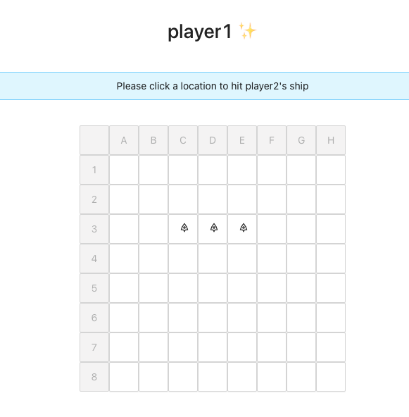
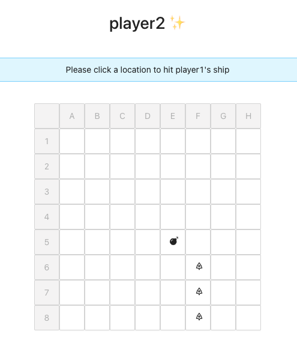
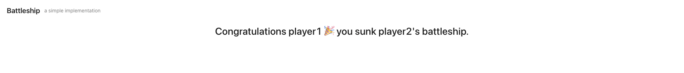

# Battleship

A simplified implementation of the classic game Battleship.

## Requirements

- Two boards, one for each player.
- A board is an 8x8 grid for a total of 64 units.
- Each player has one ship that is 3 grid units in length.
- Each player will place their ship on the board either vertically or horizontally.
- The ships cannot be placed outside the grid bounds.
- Players take turns firing at their opponents ship.
- A hit is when a ship part is in a grid unit that a player fires at.
- A ship is sunk when all the parts have been hit.
- Grid units are specified by column and row.
- Columns are labeled A to H.
- Rows are labeled 1 to 8.
- The player grid should be displayed.

## React version:

### Run the code

Use `yarn start` to run the app in development mode.

- To make sure you have all package installed, run `yarn install` to install all the dependencies listed.

### Example






## Python version:

### Run the code

`python3 battleship.py`

### Example


```
When prompt to provide a fire location, the current player's board will be displayed.
```


